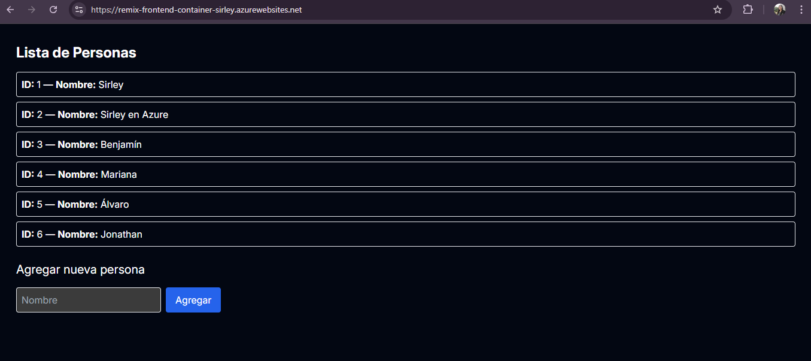
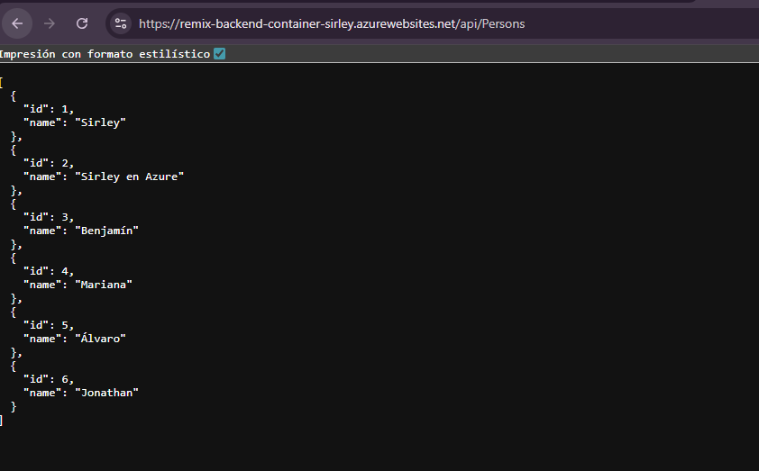
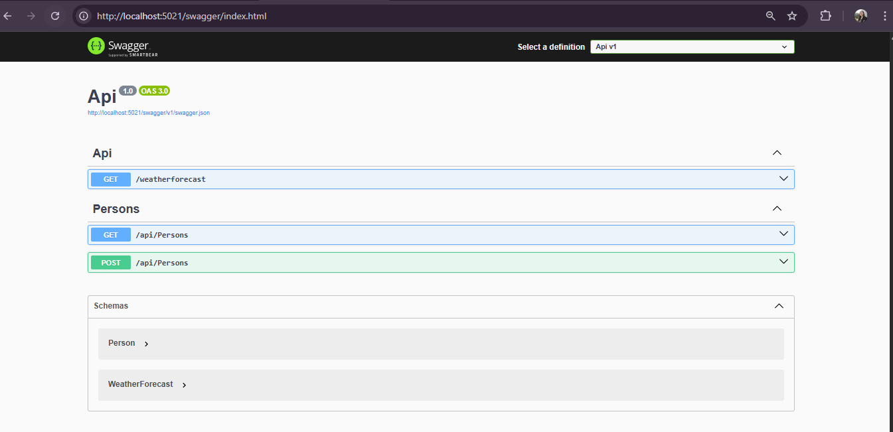
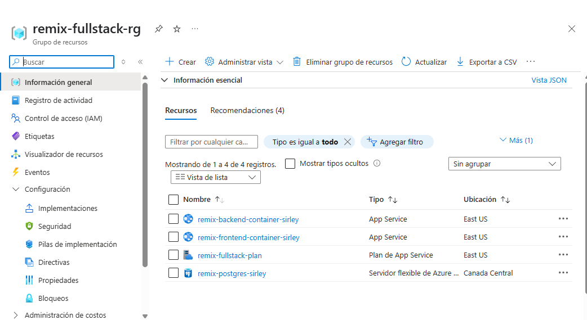
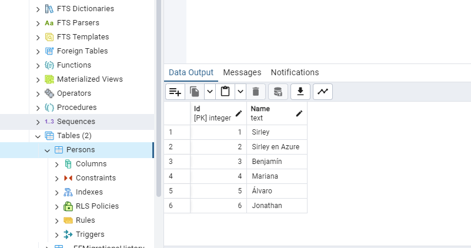

✅ README.md – Taller Fullstack: Remix + .NET 9 + Azure App Service

# 🌐 Taller Fullstack en la Nube: Remix + .NET 9 + Azure App Service (Contenedores)

✅ Descripción del Proyecto Fullstack desplegado en Azure
Este proyecto implementa una aplicación fullstack compuesta por:

Frontend: Remix + Vite

Backend: ASP.NET 9 con Entity Framework Core

Base de Datos: PostgreSQL Flexible Server en Azure

Infraestructura: Azure App Service Linux usando contenedores Docker

Despliegue: Automatización con GitHub Actions + Docker Hub

🚀 Flujo completo implementado
1. Configuración local

- Se desarrolló y probó el backend en .NET 9 con una API REST (/api/Persons)

- Se implementó Swagger para documentar los endpoints

- Se conectó a una base de datos PostgreSQL en Azure, usando Entity Framework Core

- Se agregó funcionalidad para listar y agregar personas

2. Despliegue del backend

- Se creó un contenedor Docker para el backend

- Se publicó la imagen en Docker Hub: yasminospina/remix-backend:v1

- Se creó un App Service Linux en Azure configurado como contenedor

- Se estableció el puerto 80 y se activó el log de contenedor

- Se validó que los datos fueran visibles desde el endpoint en la nube:
👉 https://remix-backend-container-sirley.azurewebsites.net/api/Persons

3. Despliegue de la base de datos

- Se creó una instancia de Azure Database for PostgreSQL Flexible Server

- Se configuraron las reglas de firewall para permitir acceso público

- Se conectó desde EF Core y desde PgAdmin

- Se aplicaron migraciones y se creó la tabla Persons en la base de datos real en Azure

4. Conexión Frontend ↔ Backend

- Se modificó el archivo frontend/app/routes/_index.tsx para:

- Consumir la API desplegada en Azure (/api/Persons)

- Mostrar personas almacenadas

- Agregar nuevas personas mediante formulario

5. Despliegue del frontend

- Se creó un contenedor Docker con el frontend Remix

- Se publicó en Docker Hub: yasminospina/remix-frontend:v2

- Se configuró el App Service de Azure para usar la imagen

- Se probó en producción:
👉 https://remix-frontend-container-sirley.azurewebsites.net

🧪 Funcionalidades finales en producción
Listar personas desde base de datos real en Azure

Agregar nuevas personas desde el frontend

Backend en .NET conectado a PostgreSQL Azure

Frontend en Remix 100% funcional, consumiendo el backend en la nube

Infraestructura desplegada en contenedores Docker, sin runtimes preinstalados

GitHub Actions configurado para automatizar builds y pushes a Docker Hub

### Vista del Frontend desplegado

### Vista del Backend desplegado

### Documentación de Swagger

### Conexión con PostgreSQL Azure

